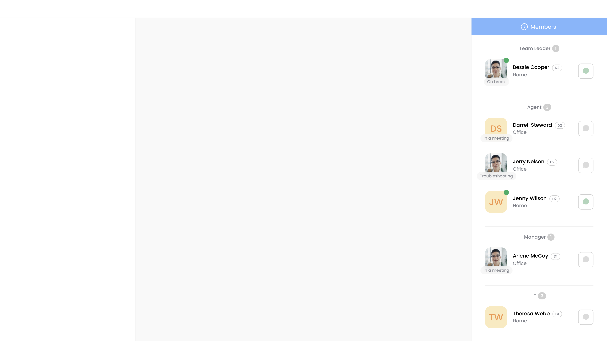
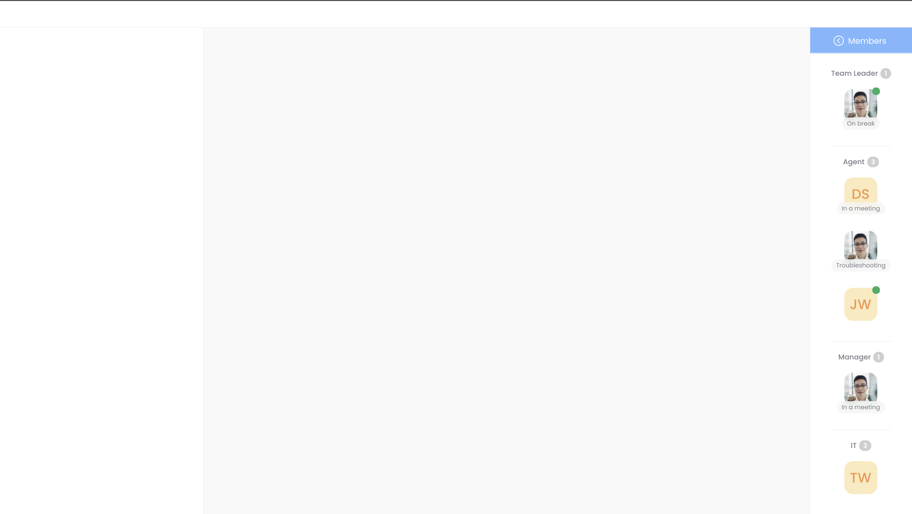

# Whitesmith - chat

Whitesmith Design + Frontend Technical Exercise




<br>

## Design

https://www.figma.com/file/oXAH4Rg3igwFkffuNIUmQC/whitesmith?node-id=0%3A1

## Demo

https://whitesmith-chat.web.app

## Features

- Open and close members sidebar without effecting chat area
- Shows Online/offline, status, display picture when sidebar is in closed state
- Configurable global style variable
- State management with VueX
- I18n support for english.
- ESLint package and configuration.

<br>

## Build Setup

```bash
# install dependencies
$ npm install

# serve with hot reload at localhost:3000
$ npm run dev

# build for production and launch server
$ npm run build
$ npm run start

# generate static project
$ npm run generate
```
